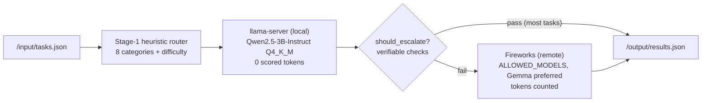

# Petasos — Hybrid Token-Efficient Routing Agent

**AMD Developer Hackathon ACT II, Track 1.** A CPU-only Docker container that answers task batches as cheaply as possible: a baked-in local 3B model handles everything it can (**zero scored tokens**), and a verifiable-check escalation gate sends only the risky remainder to Fireworks.

On our 160-task evaluation set the agent answers **97.5%+ correctly while spending 0–~900 Fireworks tokens total**, versus ~30,000 tokens for an all-remote baseline that scored *worse* (60%).

## How it works



1. **Route.** Each prompt is classified into one of 8 categories (factual, math, sentiment, summarization, NER, code-debug, logic, code-gen) by a regex/keyword router (98.8% measured routing accuracy), picking a terse per-category system prompt, a tight `max_tokens` cap, and a difficulty estimate. A trained TF-IDF classifier ships in the image as an optional Stage-2 (`ROUTER_USE_CLASSIFIER=1`, default off — the heuristic currently beats it).
2. **Answer locally first.** A baked-in Qwen2.5-3B-Instruct GGUF served by llama.cpp's `llama-server` answers every task. Local inference costs zero scored tokens.
3. **Verify cheaply.** Instead of trusting model self-confidence (poorly calibrated per the routing literature), the gate runs *verifiable checks*: math answers must produce the same final number twice (a second free local pass — dual-answer agreement), NER must be a valid JSON list, sentiment must be an allowed label, code must `ast.parse`. Categories with no cheap check escalate on hard difficulty or hedging language.
4. **Escalate surgically.** Only failed checks go to Fireworks — one remote call per escalated task, terse answer-only prompts, aggressive `max_tokens`, no chain-of-thought unless the category needs it. Among allowed models, a **Gemma** model is preferred where suitable; code tasks prefer a code-specialized model; otherwise the smallest capable model wins.

The escalation policy is not guesswork: an offline eval harness (LLM-as-judge + string metrics over a 160-task set) measured the accuracy-vs-tokens curve across nested policies, and the shipped gate sits at the knee — all-remote was measured both 35× more expensive *and* less accurate than local-first.

## Running

Inputs and outputs follow the Track 1 contract: reads `/input/tasks.json` (array of `{task_id, prompt}`), writes `/output/results.json` (array of `{task_id, answer}`), exits 0.

```bash
docker run --rm \
  -e FIREWORKS_API_KEY=... \
  -e FIREWORKS_BASE_URL=https://api.fireworks.ai/inference/v1 \
  -e ALLOWED_MODELS=accounts/fireworks/models/...,accounts/fireworks/models/... \
  -v "$(pwd)/input:/input" \
  -v "$(pwd)/output:/output" \
  ghcr.io/marios-gasparis/petasos-routing-agent:latest
```

Or with compose (reads the same variables from `.env`):

```bash
docker compose run --rm --build routing-agent
```

The entrypoint starts `llama-server`, waits for `/health` (< 60 s), runs the agent, prints `Fireworks tokens used: N`, and shuts down.

### Environment variables

| Variable | Purpose |
|---|---|
| `FIREWORKS_API_KEY` | Fireworks credentials; **all** remote calls go through the official client |
| `FIREWORKS_BASE_URL` | API root (defensively normalized — quotes/trailing paths stripped) |
| `ALLOWED_MODELS` | Comma-separated model ids, parsed at runtime — **no model id is hardcoded anywhere**; selection is by substring (prefer Gemma / code models / smallest) with non-chat models filtered out |
| `ROUTER_USE_CLASSIFIER` | optional, default off — enable the Stage-2 learned router |

## Building

```bash
docker build --platform linux/amd64 -t routing-agent .
```

The build downloads the GGUF from Hugging Face and bakes it in (startup must be fast; downloading at runtime would blow the 60 s budget). Final image is well under the 10 GB limit.

## Evaluation harness (offline, not in the container)

`eval/` measures accuracy and token spend so the escalation gate is tuned on data, not vibes. It never ships in the image and is never imported by `src/`.

```bash
python -m eval.gen_testset          # regenerate the 160-task testset
python -m eval.harness --sweep      # accuracy-vs-tokens across escalation policies
python -m eval.harness --categories code-gen,logic --limit 10   # targeted run
```

Grading combines deterministic metrics (numeric match, entity-set F1, ROUGE-L, label match) with a reference-guided, binary PASS/FAIL LLM judge via Fireworks (judge tokens are offline-only and kept in a separate counter from the agent's scored tokens).

## Design principles

- **Never sacrifice accuracy to save tokens.** The scoring is asymmetric: failing the accuracy gate scores zero, while extra tokens only lower the ranking. Every gate decision errs toward escalation.
- **Verifiable checks over self-reported confidence.** Format validation, dual-answer numeric agreement, and AST parsing are cheap, local, and better calibrated than asking a model how sure it is.
- **Local tokens are free — spend them.** The math verifier literally answers every math task twice locally; that costs seconds, not tokens.
- **Everything model-related is runtime-resolved.** Model ids come from `ALLOWED_MODELS` at call time; the base URL from the environment; no answers are hardcoded or cached.
